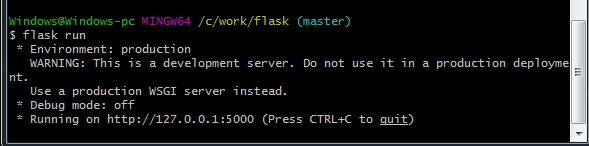
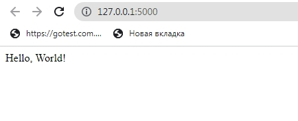

# Flask
## Simple Start
Для того, щоб використовувати фреймворк Flask його необхідно встановити як бібліотеку. Для цього в консолі <a href = "https://git-scm.com/downloads">Git Bash</a>
```
pip install Flask
```

Для простого запуску сервісу на Flask напишемо наступну програму.

```python
from flask import Flask

app = Flask(__name__)

@app.route("/")
def hello_world():
    return "<p>Hello, World!</p>"
```
Далі - відкриємо командну строку у відповідній папці та виконаємо команду:
```
flask run
```
   

Далі - відкриємо браузер за посиланням: <a href = "http://127.0.0.1:5000/" target = "_blank">http://127.0.0.1:5000/</a>  
   